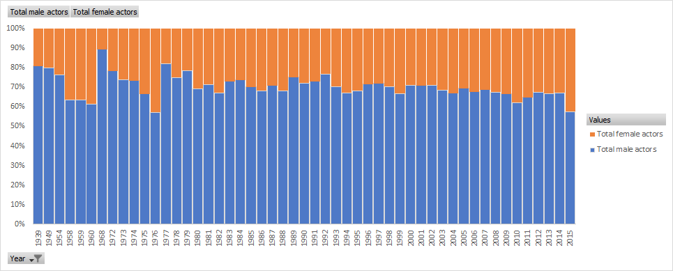

# Do (wo)men talk too much in films?  
## Abstract  
In this report, we train logistic regression, LDA, QDA, tree-based, and KNN
models to help us determine the gender of the film’s lead actor. It is done along
with determining the important features that might have helped the classifier in the
predictions. Moreover, we discuss the differences with each models and determine
which model works best for this problem.  
## Introduction  
This report is aimed at measuring whether male or female lead role is predictable from the amount
of dialogue the actors have, the year the film was made, how much money it made and so on. We
have a dataset of 1037 films containing 13 numerical variables characterising information pertinent to
the films. This is a binary classification problem that needs to be implemented to determine male or
female lead actor. The methods implemented are then tuned according to the parameters provided
and finally we evaluate the feature performances.  
## Exploratory Data Analysis  
Analysing the data, we see the distribution of male and female plotting certain characteristics.  

**Do men or women dominate speaking roles in Hollywood movies?**  
We calculated total male actors and total female actors across all films and find that the films
predominantly cast male actors. 31%(3644) actors were females whereas 69%(8070) actors were
male actors in speaking roles in Hollywood movies.

**Has gender balance in speaking roles changed over time (i.e. years)?**  
The gender balance has largely been tilted towards more male actors landing in speaking roles than
female actors in films released from 1939 to 2015. The ratio remains almost the same all these years.

**Do films in which men do more speaking make a lot more money than films in which women speak more?**  
After determining the gender of the actors with most words in each film, we found that the films
which have more dialogues for male actors make more than 7 times the money than the films which
have more dialogues for female actors. From the dataset, it was observed that 12%($14,411) of
marketshare in Revenue goes to films where women spoke the most in comparison to 88%($101,073)
marketshare in Revenue for the films where men spoke the most.  

Based on the above observations which favor male lead actors or female, a worst-case classifier would
have no more than 50-55% accuracy to classify the lead actor correctly.  

## Methods of Classification  
We use five main methods of classification: Logistic Regression, LDA, QDA, K-Nearest Neighbour and Tree Based Methods  

### Logistic Regression  
A binary Logistic regression is a binary classifier which takes in the data variables and gives the likelihood in which the data point should lie into one of the two classes. The decision boundary can be either linear or non-linear in nature. Solver used to run logistic regression was 'lbfgs', which comes as the default for this classifier. The max_iter parameter was changed from 100 to 10000 iterations for the best results and all the input variables were considered.  

The training set of 1037 data points are divided in 70/30 test and validation set, giving us a mean accuracy of 85.9% and the following confusion matrix, where 'Male' lead was set as 1 and 'Female' lead as 0:  
|Lead| Female| Male |
|---|------|-----|
|Female |55 | 36 |
|Male | 8 | 213 |

Since retraining the model with 70/30 uses the same data and can cause overfitting, we used K-fold cross validation to hold out some part of training data while retraining the model. In this way we ensured that the model does not run on the same data and overfits.  
As per K-fold cross validation method with 10 "folds" the model was trained on 9 folds and tested on the 10th fold. This was done 10 times and then the performance was averaged out from all the splits, finally we receive an average accuracy of **87.1%** with a standard deviation of 2.9% .  

### Linear Discriminant Analysis (LDA)  
LDA is a linear classifier also used for dimensionality reduction. It works by increasing the variability between the classes but reducing the separability of each data point within the class. This method is popular for preprocessing the data like images to reduce the number of features, but is not so effective when there is non-linearly separable class to deal with. The model assumes that the input data is normally distributed and each class has identical covariance matrices. We ran the LDA using *LinearDiscriminantAnalysis()* method in sklearn library, with default solver ie. *svd* (singular value decomposition)

The training set of 1037 data points are divided in 70/30 train and validation set, giving us a mean accuracy of 84% and the following confusion matrix, where 'Male' lead was set as 1 and 'Female' lead as 0:

|Lead| Female| Male |
|---|------|-----|
|Female |52 | 39 |
|Male | 11 | 210 |

As per K-fold cross validation method with k = 10 and shuffling the data before splitting them in train and validation sets, we receive an average accuracy of **86\%**  with a standard deviation of 2.9%.

### Quadratic Discriminant Analysis (QDA)  

Just like LDA, QDA works on the same principals and is used to classify data that are non-linearly separable. This means that this method works on classes that have nonidentical covariance as opposed to LDA. In a similar fashion, *QuadraticDiscriminantAnalysis()* method is used with the default solver *svd* 

The training set of 1037 data points are divided into 70/30 train and validation set, giving us a mean accuracy of 89.7\% and the following confusion matrix, where 'Male' lead was set as 1 and 'Female' lead as 0:

| Lead | Female | Male |
| --- | ------ | ----- |
| Female |65 | 26 |
| Male | 6 | 215 |
    

As per K-fold cross validation method with k = 10 and shuffling the data before splitting them in train and validation sets, we receive an average accuracy of **87.3%** with a standard deviation of 3.8%.

### K-Nearest Neighbour (KNN)  

In a classification task, K-Nearest Neighbor method classifies a given point to a certain categorical label by finding the closest distances between the point and all other K numbers of data points in the dataset. Usually, Euclidean distance is taking as a measure of distance. In practice, to find the best value of K, we use a for loop to calculate the error rates toward different values of K. And then choose the K with lowest error to train the model. An optimal value of K has to be found out because lower value may lead to over-fitting issue, and higher value of K may require more computational complication in distance.

Before building the for loop, we split the dataset into training dataset and validation dataset which is including 30 percent of data. And then do the scaling on the dataset. Because the statistical principle of KNN is to calculate the distances between data points, it is easier to calculate it with the process of normalization. After that, we use a for loop to get the error rates with various values of K from 1 to 50 so that We find the best choice of K is 4 with minimum error rate **20.19%**. Then we train the KNN model using the best K, and compare the prediction results with the validation dataset to have the final accuracy score **79.81%**. The confusion matrix is shown as follows.

|Lead| Female| Male |
|---|------|-----|
|Female |42 | 46 |
|Male | 17 | 207 |

There are some pros of using the KNN algorithm. First, it is easy to implement and runs faster than other algorithms such as linear regression, SVM and so on. Second, there is only one parameter required to be found the best one in KNN, that is, the value of K. There are also some cons of using it. First, it cannot deal with datasets with large amount of dimensions well because it is difficult to calculate Euclidean distance in each dimension. Second, it does not work well with categorical features due to the difficulties in calculating distances with categorical features.

### Tree-Based Methods

For tree-based methods, we use Random Forest and Gradient Boosting. Random Forest uses bags of trees to average out the decision for classification and extreme gradient boosting uses regularization for building trees and classifying. Extreme Gradient Boosting uses weak learners and iterates from previous trees to provide a better prediction minimizing the objective function with each iteration and using space efficient processing. In our project, we find the optimal tree depth to be 7 for random forest, with cross-validation k=10-folds. For Extreme Gradient Boosting, we find the optimal parameters through a grid search with the optimal tree depth of 7 using AUC as the scoring determinant of best score for optimal parameters. For Random Forest we obtain a 90% training accuracy and testing accuracy of **80%**. Whereas for Gradient Boosting, we obtain a 98% training accuracy and **85%** in testing accuracy. 

## Feature Importance

### Playing with features

Plotting a correlation matrix for the 13 variables provided in figure below.

As per the correlation matrix, considering the variables with values in the ranges [-1,-0.19] and [0.1,1], tells us that the variables *Gross'*(0.05), *'Number words female'*(0.05), *'Number words male'*(0.04) and *'Year'*(-0.07) have very little influence on the class *'Lead'*, lesser than what variables like *'Age Co-Lead','Age Lead','Number of female actors','Number of male actors','Difference in words lead and co-lead', 'Number of words lead'* have.

After omitting few combinations of the given variables we find the following variations(percentage) in the mean predictions using cross validation:

Performance of different models on omitted variables:  
| Variables | Logistic Regression | LDA | QDA | KNN (70/30 split) | Random forest | Boosting |  
| --------- | ----------------- | ----- | ----- | ----------------- | ------------ | ------- |  
| "Number words female", "Number words male" | 79.9 | 79.6 | 81.1 | 77.88  | 79.3 | 77.9 |  
| "Year" | 87.3  | 86 | 87.9 | 79.17    | 78.9 | 80.7 |  
| "Gross" | 87.4   | 86.2 | 86.6 | 79.17 | 80.2 | 81.1 |  
| none omitted | 87.1  | 86 | 87.3 | 79.81 | 80.5 | 85.3 |  
    
QDA score increases when we remove "Year" variable as a feature. Which was expected from our EDA, wherein it was observed that the ratio of male and female actors in the films largely remained the same all throughout the years, indicating that this variable does nothing to predict the gender of the lead.

As for KNN, by deleting "Number words female" and "Number words male", we get the obvious lower result of accuracy compared to the one without omitting. It indicates some level of explanations that words spoken by males and females contribute to the actor gender prediction. But not that much, the result conforms to the one shown in EDA. Moreover, the accuracy score just floats a little by training the KNN models without either "Year" or "Gross". It shows that either year of release or money made by film is not the decisive factor of predicting whether an lead actor is male or female.

For Tree-based methods we use two feature importance metrics, by Gini coefficient and permutation importance. Gini importance calculates the average purity for each node of all trees for a specific features. For permutation feature importance we compare the full model vs randomly peturbing the feature of interest, therefore adding noise and seeing the total contribution to the classification. In the full model where all variables are included for the feature importance we achieved a 85% accuracy vs a 81% for features that we are seeing the removal from "Number words female", "Gross" and "Year". We see that the most important variable is "Number words female". We show the Feature Permutation Importance in Figure 5.

### Discussion  

According to the EDA, it seems evident to make a conclusion that men dominate speaking roles in Hollywood movies. In our classifier models, "Year" is an unimportant variable to determine whether the actor is male or female. It indicates some levels of explanations that gender balance in speaking roles has not changed much over time. It is a pity to see that till today, females have less opportunities to dominate speaking roles. 

Also, the "Gross" feature takes less important part in predicting the gender of actor. In our opinion, the films in which men do more speaking make a lot more money than films in which women speak more can happen, but the factor is not only the number of words spoken by male but also their numbers in the movies. If a movie has more male speaking roles, under the positive correlation between "Number words male" and "Number of male actors", men speak more. Both of them lead to a phenomenon that men make more money.

From the analysis we have done, the number of words spoken by females and number of female actors are important features. We can see its clear separation when plotted in Fig 6. It makes a lot of sense that both are important features of determination especially since most films are male-dominated, so its a good way to determine the movies lead.

Missing from our analysis or for future exploration would be if this same patterns that we see throughout can also be seen in different genres where maybe certain futures would make better separation of the data.

## Production method  

After going through all 6 classification methods, it is finalized to make Quadratic Discriminant Analysis as our best production method which has given us the highest accuracy to predict the gender of the lead with cross-validation. 

## Conclusions  

In our analysis we found that the best method that performed well on the data was QDA with the highest score of 87.9\% after performing feature tuning and performed worst in the case of KNN with the highest accuracy of 79.81\%. It tells us that the data is nonlinearly seperable as it was better modeled by QDA.  

   | Models | Accuracy |  
   | ---------- | --------- |   
   | Logistic Regression | 87.4% |  
   | LDA | 86.2% |  
   | QDA  | 87.9 %  |  
   | KNN | 79.81%  |  
   | Random Forest | 80%  |  
   | Gradient Boosting | 85%  |  

## References  
https://scikit-learn.org/stable/modules/generated/sklearn.linear_model.LogisticRegression.html  
https://scikit-learn.org/stable/modules/cross_validation.html  
https://scikit-learn.org/stable/modules/generated/sklearn.discriminant_analysis.LinearDiscriminantAnalysis.html  
https://scikit-learn.org/stable/modules/generated/sklearn.discriminant_analysis.QuadraticDiscriminantAnalysis.html  
https://scikit-learn.org/stable/modules/permutation_importance.html  
https://xgboost.readthedocs.io/en/stable/tutorials/model.html  
